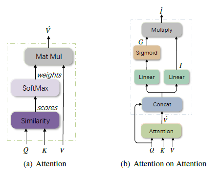
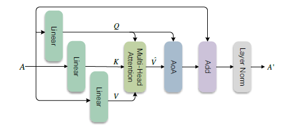
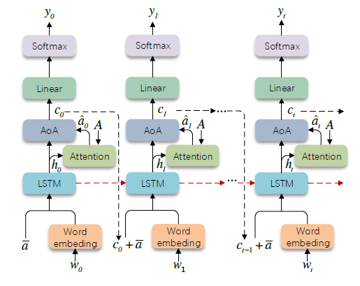

# Abstract

解码器不清楚关注的向量和注意力query是否相关或者相关程度如何，这会导致解码器输出错误的结果，因此提出一种 AoA 模块来确定注意的结果和query之间的相关性，AoA首先利用注意力结果和上下文生成information vector和attention gate， 然后通过他们进行相乘来增加另一个注意，最后得到attended information

# Introduction

序列到序列的任务中模型的输出直接取决于注意的结果，但是解码器不清楚注意的结果和query是否相关或者相关程度如何，在一些情况下，注意的结果并不是理想的情况，这就导致解码器生成错误的单词，这种情况可能发生在本身注意力模块性能不是很好或者从候选向量中无法获得有价值的信息。为此，提出AoA，他首先进行两个投影映射得到information vector和attention gate，然后进行元素相乘得到attended information

# Model

在Attention的基础上对$Q$, $\hat{V}$ 进行投影映射相加后相乘，最后输出 $\hat{I}$.  这个AoA模块（图上虚线框中的部分）是这篇论文的核心，将其分别应用在解码器和编码器中。

**解码器**

$A$是图像，经过AoA和层归一化得到$A^{'}$， 输入和输出的尺寸是一样的，这样的结构可以堆叠 $n$ 层。

**编码器**

这里采用的是LSTM去构建语言模型，每个时间步LSTM的输入是两个，词嵌入和前一时刻的 $c_{t-1}$, 也就是上下午向量加上$A$的平均值，LSTM的输出 $h_t$ 进入Attention模块得到 $\hat{a_{t-1}}$ , 其中$h_t$ 充当Attention模块中的 $Q$ , 进入AoA模块，生成 $c_t $ , 利用 $c_t $来生成 $t$ 时刻的单词。 