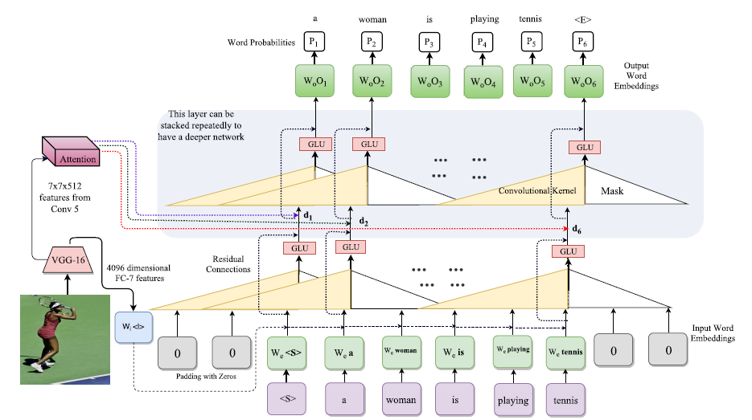

# Abstract & Introduction

主要思想就是把RNN替代成一维的卷积来生成单词。

# Model

VGG-16 是用来提取图像特征，经过Embedding后，维度变成词向量的维度，和单词的词向量一起作为卷积模块的输入。这边的Attention模块和之前一样，输出一个context vector. 层与层之间信息传输还包含了residual connection，GLU， dropout。

**在训练阶段**

输入是整个句子，这边的卷积模块采用的 masked convolution， 我的理解是相当于 kernel size 设置为3，句子头和尾各pad 2个0，图上所画的那样，采用kernel size是3, 因为在测试阶段模型只能看到 $t$ 时刻之前的单词，不能看到 $t$ 时刻之后的单词，测试时，一开始的输入只有一个 <start> 标志符，在它的两边pad 两个0，正好和训练阶段一致。随着时间 $t$ 变大，输入就会慢慢增加，这个和transformer的训练类似。卷积核的数目是自由设定，这样的层可以堆叠 $N$ 层，已达到提取句子间更加丰富的信息。

输出经过linear层投影到词汇库的维度，在进行softmax，进行多分类的任务。

==注意==  在代码中，kernel size设置为5， pad的个数为4，这样的设置就是可以处理5个单词。

**在测试阶段**

模型输入刚开始为  <start> 标志符，输出单词库分布的概率，选择最大的概率或者采用beam search，将选出的单词添加到 <start>之后，在作为模型输入，重复以上过程，直到达到最大长度或者遇到 <end> 标志符停止。