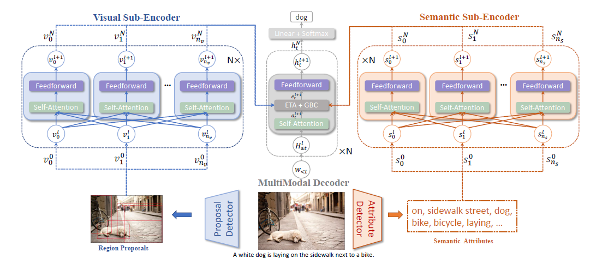
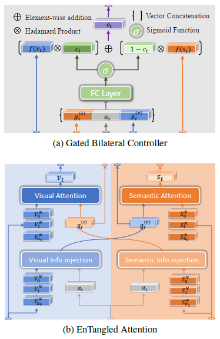

# Abstract

典型的注意力机制很难识别等效的视觉信号尤其是在预测高度抽象的单词时，比如skiing，RNN模型在设计复杂的注意力来整合视觉和语义属性时会变得不灵活，提出EnTangled Attention用于同时处理语义和视觉信息，以及Gated Bilateral Controller (GBC)处理多模态信息的交互

# Introduction

由于语义鸿沟的存在，并不是每个单词都有对应的视觉信号，尤其是抽象概念的词，有一些工作研究了semantic attention，但是其本质模型还是RNN，他很难去记忆许多时间步之前的内容。因此提出EnTangled Attention和Gated Bilateral Controller （GBC）来同时探究 visual and semantic information

# Model

**Notes：**

左侧和右侧不是中间的展开图，他们分别是各自的模块

**左侧部分（Visual Sub-Encoder）：**

对 image regions采用muti-head self-attention，经过 $N$ 层，构建对image regions高层信息

**右侧部分（Sematic Sub-Encoder）：**

先把caption中的名词，动词，介词等提取出来，经过Embedding，对这些词同 Visual Sub-Encoder 那样采用muti-head self-attention，经过 $N$ 层，构建对输入词的高层抽象信息。

**中间部分（MultiModal Decoder）：**

输入是caption的句子，前 $t-1$ 个单词，对 $t-1$个单词先进行multi-head self-attention，到ETA+GBC子模块中，这个子模块接受的输入是来自Visual Sub-Encoder的顶层输出，Sematic Sub-Encoder的顶层输出和之前的 $t-1$ 个单词的self-attention，ETA+GBC子模块有点类似于transformer中decoder部分的对encoder输出作multi-head attention，同样经过 $N$ 层，最终的输出进行softmax得到词库中各个单词的概率分布

**EnTangled Attention** **(ETA)**  **& Gated Bilateral Controller（GBC）**

ETA模块中info injection和Attention都采用multi-head attention, 这一步就行了semantic和image的融合，生成的 $v_t, s_t$ 输入进GBC， 最终输出 $e_t$ .
$$
g_t^{(s)}=MultiHead(a_t, S^N, S^N)\\
v_t = MultiHead(g_t^{(s)}, V^N, V^N)\\
--------------\\
g_t^{(v)}=MultiHead(a_t, V^N, V^N)\\
s_t = MultiHead(g_t^{(v)}, S^N, S^N)\\
--------------\\
e_t = f(v_t)\odot c_t +f(s_t)\odot (1-c_t) $f$
$$
函数 $f$ 是个激活函数，论文表明不采用任何函数效果最好，因为采用激活函数在这里的梯度值别限制在一定范围内。