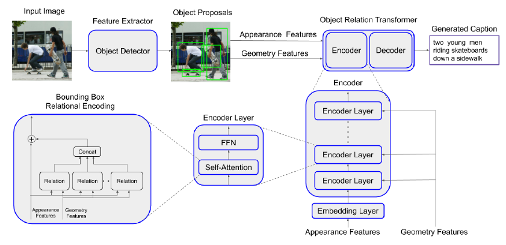

# Abstract

提出通过geometric attention将检测到的物体间的空间关系利用起来

# Introduction

利用物体的空间位置信息，能够有效的区别物体与物体之间的交互状态，比如，“a girl riding a horse” 和 “a girl standing beside a horse”，“a woman playing the guitar” and “a woman playing the ukelele（夏威夷四弦琴）”

# Model

**这篇文章的思想来自于 Relation Networks for Object Detection**，用于目标检测，而这里用在image caption中。整体结构类似于Transformer的encoder-decoder，唯一的区别就是encoder中的self-attention模块，他的输入有两个，一个是appearance features（image regions）和geometry features（位置信息）

其中核心公式：
$$
\lambda(m,n) = \left(\log(\frac{|x_m-x_n|}{w_m}), \log(\frac{|y_m-y_n|}{h_m}),\log(\frac{w_n}{w_m}),\log(\frac{h_n}{h_m})\right)\, (1)\\
w_G^{mn}=ReLU(Emb(\lambda)W_G)\,\,\, (2)\\
w^{mn}=\frac{w_G^{mn}exp(w_A^{mn})}{\sum_{l=1}^Nw_G^{ml}exp(w_A^{ml})}\,\,(3)
$$
公式(1)表明两个被检测到的对象之间的相对位置信息。$Emb(\lambda)$ 将位置维度嵌入到高维，在进行 $W_G$ 投影，输出 $N\times N $ 矩阵。 $w_A^{mn}$ 是transformer中 $\frac{QK^T}{\sqrt{d_k}}$ 的结果，也是$N\times N $ 矩阵， 公式(3) 重新计算注意力权重，用 $w$ 所表示的矩阵 乘以 $V$, 即 $wV$。上式公式即为模型结构图中的Relation模块。 

