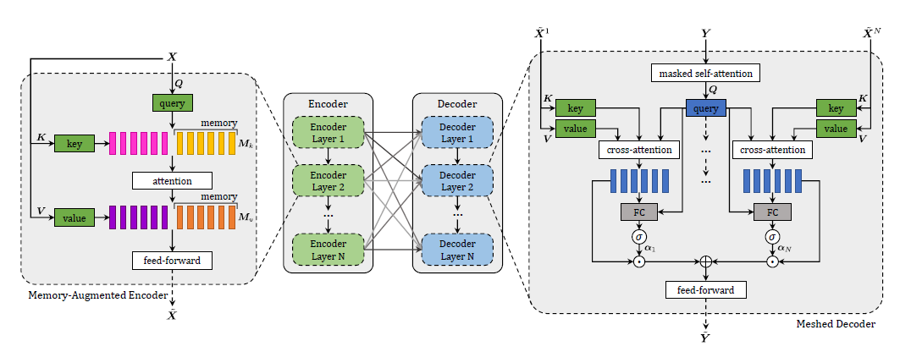

# Abstract

应用到image caption中的transformer还有待更深入的探索，提出的模型提高了图像编码和语言生成两个阶段，通过先验知识学习图像区域间关系的多层次表示，在解码阶段使用类似网格的连接方式挖掘底层和高层特征。

# Introduction

图像区域以及他们的关系被多层次的编码，将低层和高层关系考虑进来，在建模他们的关系时，模型使用memory  vectors 来学习和编码先验知识。在句子生成时使用了多层结构，利用低层-高层视觉关系而不是仅仅从视觉编码中得到一个输入。

# Model

**Encoder**
$$
Attention(Q,K,V)=softmax(\frac{QK^T}{\sqrt{d}}V)\\
S(X) = Attention(W_qX, W_kX, W_vX)\\ 
\mathcal{M}_{mem}(X) = Attention(W_qX,K,V )\\ 
K = [W_kX,M_k]\\
V = [W_vX;M_v]
$$

解码器的输入为图像 $X$，经过投影映射得到 $Q, K, V$ ,其中 $K, V$ 在图像的区域位置维度上分别拼接上 $M_k, V_k$ ,代表对这个图像的先验知识，输入输出的尺寸大小保持不变，和transformer一样，每一层采用多个头，堆叠 $n$ 层。

**Decoder**
$$
\mathcal{M}_{mesh}(\hat{\mathcal{X}}, Y)=\sum_{i=1}^n\alpha_i\cdot\mathcal{C}(\hat{\mathcal{X^i}},Y)\\
\mathcal{C}(\hat{\mathcal{X^i}},Y)=Attention(W_qY, W_k\hat{\mathcal{X^i}}, W_v\hat{\mathcal{X^i}})\\
\alpha_i=\sigma(W_i[Y, \mathcal{C}(\hat{\mathcal{X^i}},Y)]+b_i)
$$

$Y$ 是caption序列，经过masked self-attention得到 $Q$ , 在解码器中的每一层中对encoder的每一层输出 $\hat{\mathcal{X}^1}, \hat{\mathcal{X}^2}, \cdots, \hat{\mathcal{X}^N}$ 都做Attention，得到 $N$ 个输出，$ Q$ 对每个输出求 $\alpha_i$ , 尺寸和 $Q$ 一样。最后每个 $\alpha_i$ 和 $\mathcal{C}(\hat{\mathcal{X^i}},Y)​$ 相乘在相加得到一层的输出。