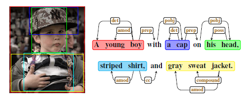

# Abstract

当前模型在描述图像时很难从外部控制和解释它的结构，由于描述图像可以以任意一种方式去进行，因此需要对他进行高度的可控性，提出一种能够生成不同描述的模型，给定一个序列或一组图像区域形式的控制信号，我们通过一个递归的体系结构生成相应的标题，该体系结构根据给定的控制约束，明确地预测基于区域的文本块。

# Introduction

现在的模型缺少可控制性和可解释性，模型生成caption的时候很难被影响到，比如，在每个时间步中选择一些区域，这个行为不能被外界所影响，也就是生成的caption是唯一的。但是一张图片可以以多种方式去描述它的内容，因此提出本文的模型可以根据给定的控制信号，这个信号可以是待描述的图像区域序列或者图像区域集合，通过关注不同图像区域以及他们之间的不同顺序来描述相同的图片。模型是建立在循环神经网络上，将句子分解成noun chunks，建模noun chunks和图像区域之间的内在联系。

# Model

对依存关系的理解：



这种依存关系分析通过spacy库来实现的，依存结构是加标签的有向图，箭头从中心词指向从属，具体来说，箭头是从head指向child，从该解析树可以看出，每个Token只有一个Head。

```python
import spacy
from spacy import displacy
nlp = spacy.load('en_core_web_sm')
text = 'A young boy with a cap on his head,striped shirt, and gray sweat jacket.'
for x in nlp(text):
    print(x.text, x.dep_, spacy.explain(x.dep_))
displacy.serve(nlp(text), style='dep') # 打开localhost：5000
```

```python
A 	     det 	 determiner              限定词
young 	 amod 	 adjectival modifier     形容词修饰语
boy 	 ROOT 	 None                    中心词
with 	 prep 	 prepositional modifier  介词修饰语
a 	     det 	 determiner              限定词
cap 	 pobj 	 object of preposition   介词宾语
on 	     prep 	 prepositional modifier  介词修饰语
his 	 poss 	 possession modifier	 拥有修饰符
head 	 pobj 	 object of preposition	 介词宾语
, 	     punct 	 punctuation    		 标点
striped  amod 	 adjectival modifier	 形容词修饰语
shirt 	 conj 	 conjunct				 连接性副词
, 	     punct 	 punctuation			 标点
and 	 cc 	 coordinating conjunction 并列连词
gray 	 amod 	 adjectival modifier	 形容词修饰语
sweat 	 compound 	 compound			 复合词
jacket 	 conj 	 conjunct				 连接性副词
. 	     punct 	 punctuation			 标点
```

