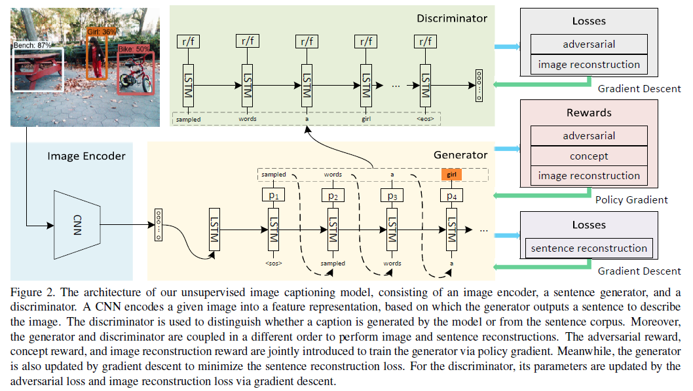

# Abstract

主要考虑到现在的image caption都是通过成对的人工标注的数据上进行训练的，标注数据的成本是昂贵的，提出只需要一个图像集，一个句子语料库和目标检测器来训练模型，其中句子语料库是让模型生成合理的句子，目标检测器是让模型识别出图像中的物体，句子语料库是从网上抓取的200万条描述图像内容的句子。

# Introduction

# Model

**Encoder**

利用CNN将Image压缩到一个特征向量中

**Generator**

使用LSTM做generator，输入图像特征向量，生成一个句子

**Discriminator**

输入是generator输出的句子，输出是该句子被认为是语料库中的句子的概率

**Training**

待补充