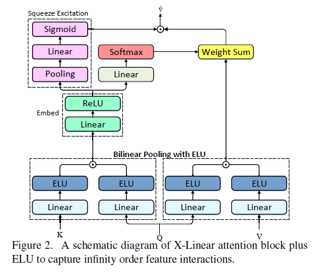
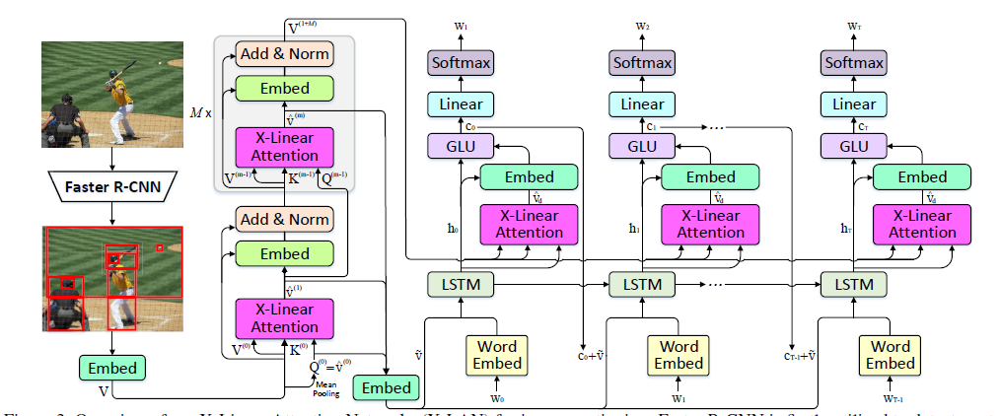

这篇和Pointing Novel Objects in Image Captioning的作者一样，京东AI实验室

# Abstract

提到Bilinear Pooling能够有效建模多模态之间的交互关系，但没有引入到image  caption任务中来，因此提出一种联合的注意力模块 X-Linear，它能够有效的提取单模态或者多模态之间的高层特征	。

# Introduction

采用encoder-decoder结构的模型，他们在输入上很少去探索多模态之间的交互关系，也就是说，视觉和语言信息被单独建模，这个问题就促使了注意力机制的发展，这种机制是依据当前时刻隐含状态有选择性的选择空间区域去指导解码器生成单词，然而这种传统的注意力机制只利用了一阶特征的交互作用，缺乏有效性和对复杂的多模态推理的能力。解决这一问题就是捕获更高阶的特征，所以X-Linear被提出来，然后阐述了他的工作机制（下文）	

# Model

这篇的思想和 Attention on Attention for Image Captioning 有点类似，先提出一个注意力模块的计算方式，然后把它嵌入到image caption模型中去。

$Q$ 分两路进行投影，分别作用在 $K, V$ 上，为以下两式,输出维度是 $D_B$：
$$
B_i^k = \sigma(W_kk_i)\odot\sigma(W_q^kQ)\\
B_i^v = \sigma(W_vv_i)\odot\sigma(W_q^vQ)
$$
然后对 $B_i^k$ 进行Embed，图中绿色部分，这边又分两路，一路经过Squeeze Excitation（粉色部分），得到输出为 $D_B$ 维度，另一路 经过Linear和Softmax（红色部分），得到 $N$ 个数值，要对 $N$ 个 $B_i^v$ 进行加权和，最后输出 $\hat{v}$ ,维度是 $D_v$ , 这里的 $D_B, D_v$ 文章中都是1024.  

把 X-Linear 应用到image caption中：

图像编码和句子解码中都有X-Linear， 这个结构类似于 Attention on Attention for Image Captioning ，不同的地方是image encoder中的每层 X-Linear 输出都会拼接在一起，进行Embed，作为LSTM的输入。在encoder中  $\hat{v}$ 当做 $Q$,  在decoder中 $h_t$ 当做 $Q$。	 